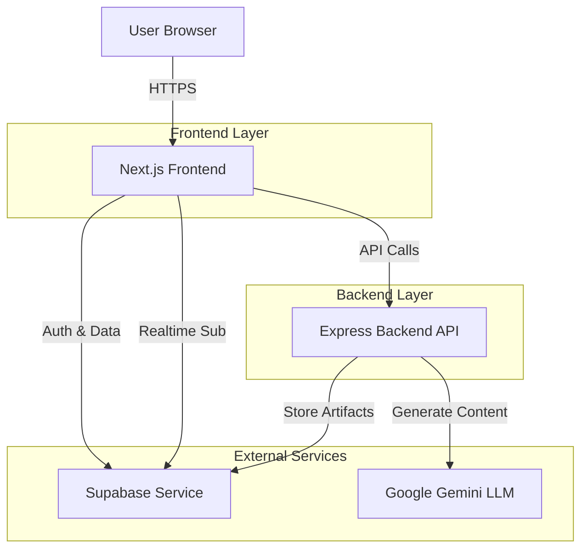
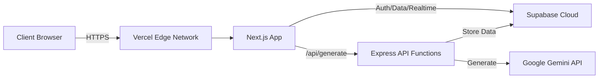

# Design Document

## Overview

AI Architect Hub is a full-stack SaaS application that transforms user app ideas into three developer-ready markdown artifacts (requirements.md, design.md, tasks.md) through AI orchestration. The system employs a sequential chain-of-thought generation pipeline where each artifact builds upon the previous one, ensuring contextual coherence and comprehensive documentation.

The architecture follows a modern serverless pattern with a Next.js frontend, Express backend API, Supabase for authentication and data persistence, and Google Gemini LLM for content generation. Real-time updates are delivered via Supabase subscriptions, providing immediate feedback as artifacts are generated.

### Key Design Principles

1. **Sequential Context Building**: Each generation step uses all previous artifacts as context
2. **Real-time Feedback**: Users see artifacts appear as they're generated
3. **Type Safety**: Comprehensive TypeScript interfaces across frontend and backend
4. **Serverless Architecture**: Stateless API endpoints deployable to Vercel
5. **Security First**: Row-level security policies and authenticated API access

## Architecture

### System Components



### Technology Stack

**Frontend:**
- Next.js 14+ (App Router)
- TypeScript 5+
- Tailwind CSS 3+
- Supabase JS Client
- jszip (for bundle downloads)

**Backend:**
- Node.js 18+
- Express.js
- TypeScript 5+
- @google/generative-ai (Gemini SDK)
- Supabase JS Client

**Infrastructure:**
- Supabase (PostgreSQL + Auth + Realtime)
- Vercel (Hosting + Serverless Functions)

### Deployment Architecture



## Components and Interfaces

### Frontend Components

#### 1. Authentication Components

**LoginPage Component**
- Renders email/password input fields
- Handles Supabase authentication
- Redirects to dashboard on success
- Displays error messages

**AuthGuard Component**
- Wraps protected routes
- Checks authentication state
- Redirects unauthenticated users to login
- Maintains session across refreshes

#### 2. Dashboard Components

**DashboardLayout Component**
- Implements split-screen layout (desktop)
- Stacks vertically on mobile (<768px)
- Left panel: Input area
- Right panel: Results grid

**InputPanel Component**
- Textarea for app idea input
- Submit button with loading state
- Character count indicator
- Error message display

**ResultsGrid Component**
- Displays artifact cards in order
- Subscribes to Supabase realtime updates
- Shows loading states during generation
- Renders download button when complete

**ArtifactCard Component**
- Glassmorphism styling (translucent, backdrop-blur)
- Displays artifact type heading
- Renders markdown content
- Glowing border effects

**ProjectHistory Component**
- Lists user's previous projects
- Shows creation timestamp
- Displays app idea preview
- Loads artifacts on selection

#### 3. UI Utilities

**GlassmorphismCard**
- Reusable translucent card component
- Backdrop-blur filter
- Light theme colors
- Subtle glowing borders

### Backend Components

#### 1. API Endpoints

**POST /api/generate**
- Authenticates request via Supabase JWT
- Validates app idea input
- Creates project record
- Orchestrates sequential generation pipeline
- Returns project ID

**Request Interface:**
```typescript
{
  appIdea: string;
  userId: string;
}
```

**Response Interface:**
```typescript
{
  success: boolean;
  projectId: string;
  error?: string;
}
```

#### 2. Generation Pipeline

**GenerationOrchestrator**
- Manages sequential artifact generation
- Handles context accumulation
- Implements retry logic with exponential backoff
- Saves artifacts to database after each step

**Pipeline Flow:**
1. Generate requirements.md (input: app idea)
2. Save requirements artifact
3. Generate design.md (input: app idea + requirements)
4. Save design artifact
5. Generate tasks.md (input: app idea + requirements + design)
6. Save tasks artifact

#### 3. LLM Integration

**GeminiClient**
- Wraps Google Gemini API
- Configures API credentials from environment
- Implements retry logic (3 attempts, exponential backoff)
- Handles rate limiting
- Returns markdown content

**Generation Methods:**
- `generateRequirements(appIdea: string): Promise<string>`
- `generateDesign(appIdea: string, requirements: string): Promise<string>`
- `generateTasks(appIdea: string, requirements: string, design: string): Promise<string>`

**System Prompts:**
- Requirements: "You are an expert Product Manager. Given the following app idea, generate a requirements.md file detailing the target audience, core user stories, and strict feature scope."
- Design: "You are an expert Software Architect. Using the attached requirements, create a design.md file specifying the ideal tech stack, database schema, and exact folder structure."
- Tasks: "You are a Lead Developer. Break down the attached requirements and design into a tasks.md file. Format this as a highly granular checklist where each item is small enough to be independently executed by an AI IDE without additional context."

### Service Layer

**SupabaseService**
- Manages database operations
- Handles authentication
- Configures realtime subscriptions
- Enforces RLS policies

**Methods:**
- `createProject(userId: string, prompt: string): Promise<Project>`
- `saveArtifact(projectId: string, type: ArtifactType, content: string): Promise<Artifact>`
- `getProjectsByUser(userId: string): Promise<Project[]>`
- `getArtifactsByProject(projectId: string): Promise<Artifact[]>`
- `subscribeToArtifacts(projectId: string, callback: Function): Subscription`

## Data Models

### Database Schema

#### profiles Table
```sql
CREATE TABLE profiles (
  id UUID PRIMARY KEY REFERENCES auth.users(id),
  email TEXT NOT NULL,
  created_at TIMESTAMPTZ DEFAULT NOW(),
  updated_at TIMESTAMPTZ DEFAULT NOW()
);
```

#### projects Table
```sql
CREATE TABLE projects (
  id UUID PRIMARY KEY DEFAULT gen_random_uuid(),
  user_id UUID NOT NULL REFERENCES profiles(id) ON DELETE CASCADE,
  prompt TEXT NOT NULL,
  created_at TIMESTAMPTZ DEFAULT NOW(),
  updated_at TIMESTAMPTZ DEFAULT NOW()
);

-- Row Level Security
ALTER TABLE projects ENABLE ROW LEVEL SECURITY;

CREATE POLICY "Users can view own projects"
  ON projects FOR SELECT
  USING (auth.uid() = user_id);

CREATE POLICY "Users can insert own projects"
  ON projects FOR INSERT
  WITH CHECK (auth.uid() = user_id);
```

#### artifacts Table
```sql
CREATE TABLE artifacts (
  id UUID PRIMARY KEY DEFAULT gen_random_uuid(),
  project_id UUID NOT NULL REFERENCES projects(id) ON DELETE CASCADE,
  artifact_type TEXT NOT NULL CHECK (artifact_type IN ('requirements', 'design', 'tasks')),
  content TEXT NOT NULL,
  created_at TIMESTAMPTZ DEFAULT NOW(),
  updated_at TIMESTAMPTZ DEFAULT NOW()
);

-- Row Level Security
ALTER TABLE artifacts ENABLE ROW LEVEL SECURITY;

CREATE POLICY "Users can view own artifacts"
  ON artifacts FOR SELECT
  USING (
    EXISTS (
      SELECT 1 FROM projects
      WHERE projects.id = artifacts.project_id
      AND projects.user_id = auth.uid()
    )
  );

CREATE POLICY "Backend can insert artifacts"
  ON artifacts FOR INSERT
  WITH CHECK (
    EXISTS (
      SELECT 1 FROM projects
      WHERE projects.id = artifacts.project_id
    )
  );
```

### TypeScript Interfaces

```typescript
// User Profile
interface Profile {
  id: string;
  email: string;
  created_at: string;
  updated_at: string;
}

// Project
interface Project {
  id: string;
  user_id: string;
  prompt: string;
  created_at: string;
  updated_at: string;
}

// Artifact
type ArtifactType = 'requirements' | 'design' | 'tasks';

interface Artifact {
  id: string;
  project_id: string;
  artifact_type: ArtifactType;
  content: string;
  created_at: string;
  updated_at: string;
}

// API Payloads
interface GenerateRequest {
  appIdea: string;
  userId: string;
}

interface GenerateResponse {
  success: boolean;
  projectId: string;
  error?: string;
}

// LLM Generation
interface GenerationContext {
  appIdea: string;
  requirements?: string;
  design?: string;
}

interface LLMResponse {
  content: string;
  model: string;
  usage: {
    prompt_tokens: number;
    completion_tokens: number;
  };
}
```


## Correctness Properties

*A property is a characteristic or behavior that should hold true across all valid executions of a system—essentially, a formal statement about what the system should do. Properties serve as the bridge between human-readable specifications and machine-verifiable correctness guarantees.*

### Property 1: Unauthenticated Access Redirect

*For any* unauthenticated request to a protected route, the system should redirect to the login page.

**Validates: Requirements 1.3**

### Property 2: Project Data Isolation

*For any* user querying projects, the system should return only projects where the user_id matches the authenticated user's ID.

**Validates: Requirements 2.6**

### Property 3: Artifact Data Isolation

*For any* user querying artifacts, the system should return only artifacts associated with projects owned by that user.

**Validates: Requirements 2.7**

### Property 4: Submission Triggers API Call

*For any* valid app idea input, clicking submit should trigger an API call to the generation pipeline 