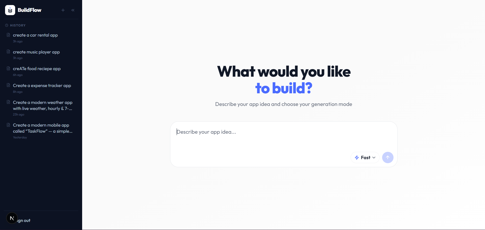

# BuildFlow (AI Architect Hub)



Transform your app ideas into developer-ready documentation with AI-powered generation. BuildFlow is a conversational, highly interactive generative workspace designed to streamline the software architecture and requirements gathering phases.

## 🌟 Overview

BuildFlow (formerly AI Architect Hub) is a full-stack SaaS application that generates comprehensive markdown artifacts from a simple app idea. Through an intuitive, chat-like interface, it creates:
- **`requirements.md`** - Detailed product requirements and user stories
- **`design.md`** - System architecture and technical design
- **`tasks.md`** - Granular development task breakdown

## 🚀 Core Features

- **Interactive Generative Workflow**: A chat-based interface to iteratively define and refine requirements before generating full artifacts.
- **Fast vs. Detailed Modes**: 
  - *Fast Mode*: One-shot generation for quick, comprehensive documentation.
  - *Detailed Mode*: A multi-stage interactive session to shape the architecture before final generation.
- **VSCode-Style Artifact Viewer**: A professional split-pane UI with a syntax-highlighted markdown file viewer for your generated docs.
- **Robust Authentication**: Powered by Supabase for secure session management and user data isolation.
- **Beautiful UI/UX**: A highly polished, custom design system utilizing Tailwind CSS, Lucide icons, Framer Motion, and Radix UI primitives.

## 🛠 Tech Stack

### Frontend
- **Next.js 16** (App Router, Turbopack)
- **React 19**
- **TypeScript** (Strict Mode)
- **Tailwind CSS v4**
- **Framer Motion / Motion** (for smooth animations and UI transitions)
- **Radix UI** (for accessible components like Dialogs and Tooltips)

### Backend
- **Next.js Route Handlers** (`app/api/**`) running on the Node.js runtime
- **Google Gemini SDK** (`@ai-sdk/google`) via the Vercel AI SDK
- **Supabase** (PostgreSQL Database & Authentication)

## 📁 Project Structure

```
ai_app/
├── app/                    # Next.js App Router
│   ├── api/                # Backend route handlers (chat, generate, projects…)
│   ├── dashboard/          # Main BuildFlow workspace
│   ├── login/              # Authentication pages
│   ├── layout.tsx          # Root layout with providers
│   ├── page.tsx            # Landing page
│   └── globals.css         # Global styles (Tailwind)
├── components/             # Reusable React components
│   ├── ui/                 # Core UI components (shadcn/radix style)
│   ├── DashboardLayout.tsx # Main application layout structure
│   ├── InputPanel.tsx      # Chat/Prompt input component
│   └── ProjectHistory.tsx  # Sidebar navigation
├── lib/                    # Utilities and services
│   ├── gemini/             # Gemini provider, client & prompts
│   ├── supabase/           # Auth and DB client helpers
│   └── theme.ts            # Shared theme definitions
└── package.json            # Scripts and dependencies
```

## ⚙️ Environment Variables

To run this project, you will need to add the following environment variables to your `.env` file (see `.env.example`):

```env
# Supabase Configuration
NEXT_PUBLIC_SUPABASE_URL=your_supabase_project_url
NEXT_PUBLIC_SUPABASE_ANON_KEY=your_supabase_anon_key
SUPABASE_SERVICE_ROLE_KEY=your_supabase_service_role_key

# Google Gemini API (provide either variable)
GEMINI_API_KEY=your_google_gemini_api_key
# GEMINI_MODEL=gemini-2.5-flash   # optional model override

# App
NEXT_PUBLIC_SITE_URL=http://localhost:3000
```

## 🚀 Getting Started

### Prerequisites
- Node.js 18+
- npm or yarn
- Supabase account & project
- Google Gemini API Key

### Installation

1. **Clone the repository**
   ```bash
   git clone <your-repo-url>
   cd ai_app
   ```

2. **Install dependencies**
   ```bash
   npm install
   ```

3. **Set up environment variables**
   ```bash
   cp .env.example .env
   # Edit .env with your specific keys
   ```

4. **Run the development server**
   ```bash
   npm run dev
   ```

5. **Open the app**
   Navigate to [http://localhost:3000](http://localhost:3000) in your browser.

## 🔧 Scripts

- `npm run dev` - Starts the Next.js development server
- `npm run build` - Builds the application for production
- `npm run start` - Starts the Next.js production server
- `npm run lint` - Runs ESLint to check for code issues

## 🎨 UI Design System

BuildFlow uses a custom design system tailored for a premium, developer-focused experience:
- **Color Palette**: Dark-mode primary aesthetic with high-contrast text and subtle borders (`bg-chat-main`, `bg-chat-sidebar1`).
- **Typography**: Clean, highly readable sans-serif fonts optimized for chat interfaces and code viewing.
- **Layout**: A responsive sidebar (`ProjectHistory`) with a main chat/results area and a fixed bottom input panel (`InputPanel`).

## 📄 License

ISC License
